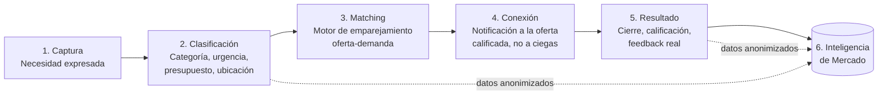

# Promot IA — Plan de Arquitectura

> "El cliente deja de buscar. Las empresas dejan de perseguir a ciegas."

Este documento define el modelo de producto, los actores, el flujo central y la arquitectura técnica y de seguridad recomendada para construir Promot IA desde cero. Es un documento vivo: se actualiza a medida que avanza el proyecto.

## 1. El problema

Hoy, quien tiene una necesidad (una persona, una empresa, una entidad pública, una constructora, un comercio) no tiene un lugar único donde expresarla y ser encontrado por quien puede resolverla. El resultado:

- **La demanda busca a ciegas**: googlea, pide referencias, compara cotizaciones manualmente, no sabe si está pagando de más o si hay una mejor opción.
- **La oferta persigue a ciegas**: invierte en publicidad, fuerza comercial y prospección fría sin saber si esos leads realmente tienen una necesidad real, presupuesto o intención de compra.
- **Nadie tiene visibilidad del mercado**: no existe una fuente que diga "esto es lo que la gente/empresas están necesitando ahora mismo, en qué categoría, en qué zona, con qué frecuencia".

## 2. La propuesta de valor

Promot IA es una **plataforma de inteligencia de demanda**: el punto de encuentro donde la demanda se hace visible (de forma estructurada y clasificada) y la oferta responde de manera eficiente, sin publicidad masiva ni prospección a ciegas.

Tres capas de valor, no solo una:

1. **Matching** (el producto visible): conectar necesidades reales con quien puede resolverlas.
2. **Clasificación** (el motor invisible): estructurar necesidades no estructuradas (texto libre) en categorías, urgencia, presupuesto, ubicación.
3. **Inteligencia de mercado** (el producto B2B adicional): vender/dar acceso a reportes agregados y anonimizados de tendencias de demanda — esto es lo que convierte a Promot IA en algo más que un "marketplace más" y le da un segundo motor de ingresos independiente del matching.

## 3. Actores del sistema

**Lado de la demanda** (quien tiene una necesidad):
- Personas naturales
- Empresas
- Entidades públicas (potencial encaje futuro con procesos de contratación/licitación pública en Colombia — SECOP — como fuente adicional de "necesidades" ya públicas)
- Constructoras
- Comercios

**Lado de la oferta** (quien resuelve necesidades):
- Empresas / profesionales / contratistas registrados, clasificados por categoría de servicio/producto, cobertura geográfica y capacidad.

**Interno**:
- Equipo Promot IA (moderación, soporte, curaduría de categorías, revisión de calidad de matches, panel de administración).

## 4. Flujo central del producto



1. **Captura**: formulario guiado (no un campo de texto libre suelto) donde quien tiene la necesidad la describe — qué necesita, para cuándo, presupuesto estimado, ubicación. Web al inicio; WhatsApp/conversacional como canal adicional después (Atlas Corporation ya tiene experiencia con flujos de WhatsApp, se puede reutilizar ese conocimiento).
2. **Clasificación**: la necesidad se etiqueta con categoría/subcategoría de un taxonomía controlada (no categorías libres — esto es clave para que el matching y la inteligencia de mercado funcionen). En el MVP esto puede ser manual/reglas simples; en la fase 2 se automatiza con IA (embeddings + un modelo de lenguaje que sugiere categoría, y un humano solo confirma en casos dudosos).
3. **Matching**: el motor compara la necesidad clasificada contra el catálogo de oferta registrada (categoría, cobertura, capacidad, calificación histórica) y genera una lista corta de candidatos — no una difusión masiva a todos los proveedores.
4. **Conexión**: se notifica a la oferta seleccionada (no se publica la necesidad abierta a cualquiera); la demanda ve quién responde. Aquí es donde "la oferta responde" en vez de "la oferta persigue".
5. **Resultado y feedback**: se registra si hubo cierre, calidad del servicio, cumplimiento — esto alimenta la calificación de cada proveedor para mejorar el matching futuro.
6. **Inteligencia de mercado**: todo el histórico de necesidades (agregado y anonimizado — nunca se vende ni expone información identificable de una persona o empresa individual) alimenta reportes: qué se está demandando, dónde, con qué frecuencia, qué tan bien se está supliendo. Este es el producto que se le puede vender a gremios, constructoras grandes, entidades públicas o inversionistas de mercado.

## 5. Modelo de datos (alto nivel)

Entidades principales, sin entrar en el detalle de columnas todavía:

- **usuarios** (personas/empresas del lado demanda — cuenta, rol, datos de contacto)
- **proveedores** (empresas del lado oferta — categorías que atienden, cobertura, verificación/KYC básico)
- **necesidades** (lo que capturamos: descripción, categoría, subcategoría, urgencia, presupuesto, ubicación, estado)
- **categorías** (taxonomía controlada, jerárquica)
- **matches** (relación necesidad↔proveedor propuesto, con score y estado: propuesto/aceptado/rechazado/cerrado)
- **calificaciones** (feedback post-cierre, alimenta el score de cada proveedor)
- **eventos_auditoria** (quién hizo qué y cuándo — necesario tanto para seguridad como para poder confiar en los reportes de inteligencia de mercado)

## 6. Arquitectura técnica recomendada

Dado que ya tienes experiencia reciente con un stack similar (Tablero Piscinas usa Supabase con roles y RLS), se recomienda continuidad de stack para avanzar rápido con buenas prácticas ya validadas:

| Capa | Recomendación | Por qué |
|---|---|---|
| Frontend | Next.js / React + Tailwind | Permite empezar como sitio simple (landing) y crecer hacia una app completa sin reescribir |
| Backend / API | Funciones/API del propio framework + Supabase (Postgres) | Evita mantener servidores propios; Postgres es robusto para el modelo relacional de necesidades/proveedores/matches |
| Autenticación | Supabase Auth (o equivalente) con roles (demanda/oferta/admin) | Cada rol ve y puede hacer solo lo que le corresponde — esto se aplica también a nivel de base de datos, no solo en el frontend |
| Clasificación de necesidades | API de un modelo de lenguaje (ej. Claude) + reglas propias para la taxonomía | La IA sugiere, la taxonomía controla — evita que el modelo "invente" categorías inconsistentes |
| Hosting | Vercel (frontend) + Supabase (datos) | Mismo patrón que ya usas en otros proyectos, sin infraestructura nueva que aprender |
| Notificaciones | WhatsApp Business API / email transaccional | Reutiliza el patrón ya probado en Atlas (wa.me / formularios) |

Esto es una recomendación de partida, no una decisión cerrada — se puede ajustar cuando definamos presupuesto y volumen esperado.

## 7. Seguridad e integridad — principios desde el día 1

Como pediste que cada parte se construya pensando en ciberseguridad desde el inicio, estos son los principios que se aplican a **todo** lo que construyamos, no como una fase final:

1. **Row Level Security (RLS) en la base de datos**: cada usuario solo puede leer/escribir lo que le corresponde por su rol, aplicado a nivel de base de datos — no solo ocultando botones en el frontend. Un usuario no debería poder ver la necesidad de otro usuario aunque manipule la petición.
2. **Autenticación real y roles claros**: demanda, oferta y admin son roles distintos con permisos distintos, verificados en cada operación sensible.
3. **Cifrado en tránsito y en reposo**: HTTPS en todo, datos sensibles cifrados en la base de datos donde aplique.
4. **Protección de datos personales (Habeas Data, Ley 1581 de 2012 en Colombia)**: política de tratamiento de datos clara desde el primer formulario de captura, consentimiento explícito, y el dato de una "necesidad" de una persona natural se trata con el mismo cuidado que un dato personal — nunca se expone identificable en los reportes de inteligencia de mercado.
5. **Nunca credenciales en el código**: variables de entorno / secret manager, nunca claves ni contraseñas en el repositorio Git. El `.gitignore` del proyecto ya está preparado para esto desde el primer commit.
6. **Validación de entradas en el servidor**: todo lo que un usuario envía (formularios, API) se valida en el backend, no solo en el frontend — previene inyección SQL, XSS y abuso del motor de matching.
7. **Rate limiting y anti-abuso**: límites en formularios y API públicas para evitar spam de "necesidades" falsas o scraping del catálogo de proveedores.
8. **Auditoría**: registro de eventos clave (quién creó/modificó/vio qué) — necesario tanto para seguridad como para poder defender la integridad de los datos que alimentan la inteligencia de mercado (si los datos no son confiables, el producto de inteligencia no vale nada).
9. **Backups y plan de continuidad**: copias de seguridad automáticas de la base de datos desde el primer entorno de producción, no como algo que se agrega después de un incidente.
10. **Revisión de seguridad continua**: antes de cada lanzamiento importante se puede correr una revisión de seguridad dedicada sobre los cambios (ya existe esa herramienta disponible en este flujo de trabajo) — se recomienda usarla como parte del proceso, no solo al final.

## 8. Modelo de negocio (hipótesis de partida)

- **Suscripción para la oferta**: empresas/proveedores pagan una membresía para recibir necesidades calificadas de su categoría/zona (reemplaza su gasto en publicidad y fuerza comercial).
- **Comisión por cierre** (opcional, a validar): un porcentaje sobre negocios cerrados a través de la plataforma.
- **Inteligencia de mercado como producto B2B/B2G**: reportes y dashboards de tendencias de demanda vendidos a gremios, constructoras grandes, entidades públicas o inversionistas — este es el diferenciador frente a un marketplace tradicional.

## 9. Roadmap por fases

- **Fase 0 — Validación (ahora)**: landing page de presentación + captura de lista de espera (empresas interesadas en oferta, personas interesadas en demanda) para validar interés real antes de construir el motor completo.
- **Fase 1 — MVP**: registro básico de demanda y oferta, formulario de captura de necesidad, clasificación y matching **manual/asistido** (un humano del equipo revisa y conecta), sin IA todavía — permite lanzar rápido y aprender el patrón real de necesidades antes de automatizar.
- **Fase 2 — Automatización**: clasificación automática con IA, motor de matching por reglas + score, notificaciones automáticas.
- **Fase 3 — Inteligencia de mercado**: panel de reportes agregados, primeras ventas de este producto adicional; explorar integración con fuentes públicas (ej. procesos SECOP) para entidades públicas y constructoras.

## 10. Estructura del proyecto sugerida

```
PromotIA/
├── docs/              ← este documento y futuros documentos de producto/arquitectura
├── assets/            ← logo, imágenes de marca
├── (fase 0) landing/  ← sitio estático de presentación, mismo patrón que Atlas
└── (fase 1+) app/     ← aplicación completa (cuando pasemos de landing a plataforma)
```

## 11. Próximos pasos inmediatos

1. Confirmar/ajustar este plan contigo (nombres de categorías iniciales, si ya tienes proveedores/clientes piloto identificados, presupuesto disponible).
2. Construir la **landing page de Fase 0** con el logo ya compartido, propuesta de valor y formulario de lista de espera — para empezar a validar interés mientras se construye el resto.
3. Definir la taxonomía inicial de categorías (con qué tipo de necesidades arrancamos: construcción, servicios profesionales, comercio, etc.) — esto condiciona todo el modelo de datos.
