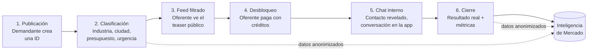

# Promot IA — Plan de Arquitectura

> "El cliente deja de buscar. Las empresas dejan de perseguir a ciegas."

Este documento define el modelo de producto, los actores, el flujo central y la arquitectura técnica y de seguridad recomendada para construir Promot IA desde cero. Es un documento vivo: se actualiza a medida que avanza el proyecto.

**Mercado inicial a explorar:** Ingeniería + Construcción (define la primera taxonomía de industrias/categorías a lanzar).

**Estructura corporativa (confirmado):** Promot IA es una marca de **Atlas Corporation S.A.S.**, empresa dueña de la idea — no es una sociedad separada. Esto se refleja en la política de tratamiento de datos (`docs/POLITICA-DATOS.md`) y deberá reflejarse también en los términos y condiciones y el pie legal de la futura landing/app.

## 1. El problema

Hoy, quien tiene una necesidad (una persona, una empresa, una entidad pública, una constructora, un comercio) no tiene un lugar único donde expresarla y ser encontrado por quien puede resolverla. El resultado:

- **La demanda busca a ciegas**: googlea, pide referencias, compara cotizaciones manualmente, no sabe si está pagando de más o si hay una mejor opción.
- **La oferta persigue a ciegas**: invierte en publicidad, fuerza comercial y prospección fría sin saber si esos leads realmente tienen una necesidad real, presupuesto o intención de compra.
- **Nadie tiene visibilidad del mercado**: no existe una fuente que diga "esto es lo que la gente/empresas están necesitando ahora mismo, en qué categoría, en qué zona, con qué frecuencia".

## 2. La propuesta de valor

Promot IA es una **plataforma de inteligencia de demanda**: el punto de encuentro donde la demanda se hace visible (de forma estructurada y clasificada) y la oferta responde de manera eficiente, sin publicidad masiva ni prospección a ciegas.

Tres capas de valor:

1. **Marketplace de intenciones de demanda** (el producto del MVP): el demandante publica lo que necesita; el oferente paga por acceder a esa oportunidad.
2. **Clasificación** (el motor invisible): estructurar necesidades no estructuradas en industria, ubicación, presupuesto y urgencia.
3. **Inteligencia de mercado** (producto de fase posterior): reportes agregados y anonimizados de tendencias de demanda — el segundo motor de ingresos, independiente del cobro por desbloqueo. Su producto concreto es el **Observatorio de la Demanda** (sección 8).

## 3. Dos ecosistemas — y un tercer actor

La plataforma tiene dos lados con flujos y economía completamente distintos. No es un marketplace simétrico — el demandante nunca paga por publicar; el oferente paga por acceder.

### Demandante (quien tiene una necesidad)

Personas, empresas, entidades públicas, constructoras, comercios.

**Flujo:** crear cuenta → publicar una Intención de Demanda (ID) → recibir el interés de las empresas que la desbloquean (potencialmente varias) → elegir con cuál(es) hablar por el chat interno → cerrar (o no) el negocio.

El demandante **no paga** por publicar ni por recibir interés — el ingreso viene del lado oferente.

### Oferente (quien busca oportunidades)

Empresas/profesionales registrados que pagan por acceder a intenciones de demanda de su industria.

**Flujo:** crear cuenta → suscribirse a un plan de créditos → explorar el feed de IDs disponibles en su industria/ciudad (solo ve la versión pública, sin datos de contacto) → decide desbloquear una ID específica (consume 1 crédito) → obtiene datos de contacto + adjuntos + chat interno habilitado con ese demandante → gestiona la relación comercial dentro de la plataforma.

### El tercer actor: el conocimiento del mercado

Demandante y oferente no son los únicos que le sacan valor a la plataforma. Cada necesidad publicada y cada interacción dejan un rastro agregado que, por sí solo, es valioso para quien quiera entender cómo se mueve el mercado — sin necesidad de publicar una necesidad ni de pagar por desbloquear ninguna. Ese tercer actor no participa en el marketplace; consume **inteligencia de mercado**. Su producto concreto es el **Observatorio de la Demanda** (sección 8).

## 4. Flujo central del producto



1. **Publicación**: el demandante llena el formulario de Intención de Demanda (ID) — ver estructura completa en la sección 5.
2. **Clasificación**: la ID queda etiquetada por industria/subcategoría (taxonomía controlada, no texto libre), ciudad, país, rango de presupuesto y nivel de urgencia.
3. **Feed filtrado**: cada oferente ve, según su industria y cobertura, un feed de IDs en su versión **pública** (teaser) — título, industria, ciudad, rango de presupuesto, urgencia, descripción y una miniatura de cada adjunto como gancho, pero **sin** datos de contacto ni los archivos originales. El orden del feed y las alertas prioritarias los define el **Índice de Afinidad Comercial (IAC)** — ver sección 6.
4. **Desbloqueo**: el oferente hace clic en "Desbloquear contacto" en la ID que le interesa. Esto consume 1 crédito de su plan y es el paso crítico de todo el negocio — el detalle técnico está en la sección 10.
5. **Chat interno**: al desbloquear, se revelan los datos de contacto y los adjuntos completos (más allá de la miniatura ya visible en el teaser), y se habilita un hilo de mensajería entre esa ID y ese oferente. Toda la negociación ocurre dentro de la plataforma (ver sección 11).
6. **Cierre y feedback**: se registra si hubo negocio cerrado, con qué oferente y por qué valor estimado — esto alimenta tanto la calificación del oferente como la inteligencia de mercado agregada.

**Nota importante:** a diferencia de un modelo de "matching algorítmico" que empuja la necesidad a proveedores elegidos por el sistema, el MVP es un modelo de **marketplace auto-servicio**: el sistema filtra el feed por industria/ciudad, pero es el oferente quien decide qué oportunidades desbloquear. El matching automático/con IA (sugerir a qué oferentes notificar proactivamente) queda para una fase posterior (ver roadmap).

## 5. Estructura de una Intención de Demanda (ID)

Formulario que llena el demandante al publicar:

| Campo | Tipo | Notas |
|---|---|---|
| Título corto | Texto | Lo primero que ve el oferente en el feed |
| Industria | Selector (taxonomía controlada) | Arranca con subcategorías de Ingeniería + Construcción |
| País | Selector | |
| Ciudad | Selector/texto | Visible en el teaser; la dirección exacta no |
| Presupuesto estimado | Rango (mín–máx) | Visible en el teaser — ayuda al oferente a decidir si vale la pena desbloquear |
| Descripción detallada | Texto largo | Visible en el teaser |
| Fecha requerida | Fecha concreta | Distinta de la urgencia — ayuda a la empresa a organizar su agenda; visible en el teaser |
| Urgencia | Baja / Media / Alta | Se muestra como etiqueta ("Alta prioridad") en el teaser |
| Adjuntos | Archivos (PDF, planos, fotos, video) | **Miniatura pública como gancho; archivo completo solo tras desbloqueo** |

**Contenido público (teaser, antes de pagar)** — lo que ve el oferente en el feed y en la tarjeta de la ID: título, industria, ciudad, rango de presupuesto, urgencia, descripción, **y una miniatura/preview de cada adjunto** (pensada como gancho para incentivar el desbloqueo — ej. una foto borrosa o recortada, o la primera página de un PDF/plano en baja resolución). No incluye datos de contacto ni el archivo original en resolución completa.

**Contenido desbloqueado (después de pagar):** nombre/razón social y datos de contacto del demandante, los archivos adjuntos completos (resolución/calidad original), y acceso al chat interno.

> **Nota técnica:** generar la miniatura (thumbnail) de forma automática al subir el adjunto — para PDFs/planos, renderizar la primera página como imagen; para fotos, una versión reducida/recortada; para video, un frame o miniatura estática. La miniatura se sirve públicamente, el archivo original queda protegido por RLS igual que el resto del contenido post-desbloqueo.

**Estados de una ID (workflow operativo):** Publicada → Desbloqueada (por 1 o más oferentes) → En conversación → Cerrada / Perdida / Cancelada. Es distinto del **nivel de confianza** de Demanda Verificada (sección 9) — el estado dice en qué punto del proceso está la ID; el nivel de confianza dice qué tan auténtica y activa es.

## 6. Índice de Afinidad Comercial (IAC)

Una función **exclusiva** de Promot IA: un puntaje calculado automáticamente que mide qué tan bien encaja una empresa oferente con una necesidad específica — no es un score general y estático de la empresa, es específico a cada par (necesidad, oferente). Es el mecanismo detrás del "% de afinidad" que ordena el feed del oferente; aquí queda definido formalmente qué lo compone y qué dispara.

### Factores que lo componen

| Factor | Qué mide | De dónde sale (ya definido en este documento) |
|---|---|---|
| Especialidades | Coincidencia entre la industria de la ID y las especialidades del oferente | `usuarios_oferente` |
| Experiencia | Años de experiencia y proyectos atendidos | `usuarios_oferente`, historial de desbloqueos |
| Ubicación | Cercanía entre la ciudad de la ID y las ciudades donde opera el oferente | `usuarios_oferente.ciudades` vs `necesidades.ciudad` |
| Capacidad operativa | Tamaño de la empresa frente a la escala de la ID | `usuarios_oferente.empleados` vs `necesidades.presupuesto` |
| Historial en la plataforma | Antigüedad y actividad reciente | fecha de registro, frecuencia de uso |
| Valor de proyectos realizados | Valor acumulado de negocios cerrados vía la plataforma | `desbloqueos` cerrados × presupuesto real |
| Tiempo de respuesta | Qué tan rápido responde en el chat interno | `mensajes` (sección 11) |
| Evaluaciones | Calificación de clientes anteriores | `calificaciones` |

Ningún factor requiere capturar información nueva — el IAC combina datos que el resto de este documento ya define que se recolectan.

### Cómo se activa

1. Se publica una nueva ID.
2. El sistema calcula el IAC de cada oferente elegible (especialidad/industria compatible, como mínimo) frente a esa ID específica.
3. A los oferentes con IAC más alto se les envía una **alerta prioritaria** — no dependen de encontrarla navegando el feed, la plataforma se las señala primero.
4. El resto de oferentes compatibles la ven igual en su feed, ordenado por IAC descendente, sin la alerta prioritaria.

**Beneficio de dos vías:** el demandante recibe interés de empresas genuinamente más adecuadas (menos ruido, mejores propuestas); el oferente se entera primero de las oportunidades que mejor encajan con su perfil real, sin revisar manualmente todo el feed.

**Nota de producto:** ponerle nombre propio a este mecanismo (en vez de dejarlo como "un algoritmo de matching interno") es una decisión de marca, no solo técnica — funciona como una métrica reconocible que las empresas empiecen a mencionar y a querer mejorar, similar a un puntaje de crédito para el mundo B2B de servicios. Vale la pena protegerlo como parte de la identidad de Promot IA.

**Integridad del cálculo:** varios factores (años de experiencia, número de empleados, certificaciones) son datos que el propio oferente declara — no deben pesar en el IAC hasta cruzarse con el estado de verificación (ver perfil de reputación en la landing, Módulo 4): un dato no verificado pesa menos o no cuenta todavía. Los pesos exactos de cada factor y el umbral para "alerta prioritaria" se calibran en la Fase 2 con datos reales de uso — fijar pesos arbitrarios antes de tener volumen que calibrar sería prematuro. Un MVP puede lanzar con una versión simple (solo especialidad + ciudad) mientras se acumula el historial que el IAC completo necesita.

## 7. Índice de Oportunidad (IO)

Otra función exclusiva, complementaria al IAC pero midiendo algo distinto: **el IAC mide qué tan bien encaja una empresa con una necesidad** (score personalizado, por par); **el IO mide qué tan buena es la oportunidad en sí misma** — el mismo puntaje para cualquier oferente que la vea, sin importar su perfil. No todas las necesidades publicadas valen lo mismo el tiempo de una empresa, y el IO es lo que lo hace visible antes de que el oferente invierta un crédito.

### Factores que lo componen

| Factor | Qué mide | De dónde sale |
|---|---|---|
| Valor estimado del proyecto | Tamaño del presupuesto | `necesidades.presupuesto_min/max` |
| Urgencia | Qué tan probable es un cierre rápido | `necesidades.urgencia` |
| Probabilidad de contratación | Qué tan probable es que esta necesidad termine en un negocio real | Heurística inicial — candidato a modelo predictivo real una vez haya historial de cierres (Capa 4 del MID, ver `docs/MOTOR-INTELIGENCIA-DEMANDA.md`) |
| Calidad de la información | Qué tan completa y específica es la publicación | Completitud de los 3 campos guiados de contexto, presencia de adjuntos, fecha y presupuesto definidos |
| Disponibilidad de presupuesto | Si el demandante especificó un rango de presupuesto o lo dejó vacío | `necesidades.presupuesto_min/max` (definido o nulo) |
| Nivel de competencia | Cuántos oferentes ya desbloquearon la misma ID | Conteo de `desbloqueos` para esa ID |

### Cómo se usa

- Se calcula al publicarse la ID (igual que el IAC) y se recalcula cuando cambian sus insumos — por ejemplo, cada vez que otro oferente la desbloquea, sube el nivel de competencia.
- Se muestra en el feed como una **señal complementaria al IAC**, pensada como un nivel (Alta / Media / Baja oportunidad) en vez de otro porcentaje — para no saturar la tarjeta con dos números que compitan por la atención.
- Ayuda al oferente a decidir en qué orden invertir su tiempo y sus créditos cuando varias necesidades tienen un IAC similar: lo ideal es priorizar donde IAC **y** IO son altos.

**Sobre "probabilidad de contratación":** es el factor más difícil de estimar sin historial. Arranca como una heurística simple (calidad de información + presupuesto disponible + si el demandante tiene la cuenta verificada) y, una vez la Capa 4 del MID tenga suficientes casos reales de "cerrado" vs. "perdido" para comparar, puede convertirse en un modelo predictivo entrenado con esos datos — no antes, por la misma razón que el IAC no fija pesos arbitrarios sin evidencia real.

**Integridad:** un nivel de competencia alto no debe usarse para ocultar una necesidad legítima — puede significar que el mercado ya validó que vale la pena. El IO es un apoyo para priorizar, no un filtro: el oferente sigue viendo todo su feed; el IO solo ayuda a decidir por dónde empezar.

## 8. El Observatorio de la Demanda

El producto concreto del tercer actor (sección 3): un panel ejecutivo con indicadores en tiempo real sobre cómo se mueve el mercado — pensado para quien quiere entender el mercado, no necesariamente participar en él como demandante u oferente. Así, la plataforma no se limita a conectar dos lados: también genera y vende **conocimiento del mercado** como producto propio. Prototipo visual: `app/panel-inteligencia.html` (Pantalla 15).

### Indicadores del panel

| Indicador | Qué muestra | De dónde sale (MID, `docs/MOTOR-INTELIGENCIA-DEMANDA.md`) |
|---|---|---|
| Oportunidades publicadas hoy | Conteo de necesidades creadas en el día | Conteo directo sobre `necesidades` |
| Sectores con mayor crecimiento | Industrias con mayor variación positiva vs. el periodo anterior | `tendencias_mercado` (Capa 4) |
| Regiones con mayor actividad | Ciudades con más necesidades publicadas | `vista_demanda_industria_ciudad` (Capa 3) |
| Tiempo promedio hasta el primer contacto | Promedio entre publicación y el primer desbloqueo/mensaje | Nueva vista `vista_tiempo_primer_contacto` |
| % de necesidades atendidas | Necesidades con al menos un desbloqueo, sobre el total publicado en el periodo | Nueva vista `vista_tasa_atencion` |
| Servicios más solicitados | Industrias/subindustrias con más necesidades publicadas | `vista_demanda_industria_ciudad` |
| Valor estimado del mercado generado | Suma del punto medio de presupuesto de las necesidades del periodo | Nueva vista `vista_valor_mercado_generado` |

> **Confirmado:** "valor del mercado generado" es el valor de las **oportunidades publicadas** (tamaño de la demanda visible), no solo el de los negocios cerrados — por ahora. Si más adelante se quiere destacar también el valor efectivamente capturado, puede convivir como un segundo indicador separado.

### Privacidad (hereda las reglas de la Capa 3 del MID)

Todos estos indicadores son agregados — ninguno expone una necesidad ni una empresa individual. Si un filtro del panel (ej. "ver por ciudad X + industria Y") produce un cruce con menos muestras que el umbral mínimo de agregación (Capa 3 de `docs/MOTOR-INTELIGENCIA-DEMANDA.md`), ese dato específico no se muestra en vez de mostrarse con poca gente detrás.

### "Tiempo real", en la práctica

No todos los indicadores tienen la misma cadencia: los conteos simples (oportunidades publicadas hoy) se calculan al vuelo; las comparaciones de tendencia (crecimiento por sector, valor de mercado por periodo) dependen del job periódico de la Capa 4 (propuesto mensual en el MID) — con suficiente tráfico real, vale la pena revisar si alguno necesita una cadencia más corta (diaria).

### Modelo de acceso

Es la forma concreta del "motor secundario de negocio" ya descrito (sección 15). **Confirmado:** el Observatorio se lanza **gratuito** inicialmente — juega a favor de la marca y de atraer más demandantes/oferentes. El acceso completo de pago (histórico, filtros por ciudad/industria, exportación) para gremios, constructoras grandes o entidades públicas queda como una evolución posterior, no como condición para lanzarlo.

## 9. Demanda Verificada

No todas las publicaciones valen lo mismo — algunas son necesidades reales y bien documentadas, otras pueden quedar sin confirmar. Demanda Verificada es un sistema de **niveles de confianza** que se muestra al oferente antes de decidir si desbloquea — una capa adicional, no un reemplazo, del estado operativo ya definido (sección 5).

### Niveles de confianza

| Nivel | Qué significa | Cuándo se alcanza |
|---|---|---|
| Demanda publicada | Necesidad recién registrada, sin verificar todavía | Al publicarse la ID |
| Demanda verificada | Se confirmó que la información es auténtica | Verificación automática (y, si aplica, revisión manual) — ver criterios abajo |
| Demanda activa | El demandante está recibiendo propuestas | Al menos un oferente la desbloqueó |
| Proyecto adjudicado | Ya eligió un proveedor | El demandante marca la ID como cerrada con un oferente específico |

### Qué significa "verificar" en la práctica

- **Contacto confirmado**: el correo y/o teléfono del demandante fueron confirmados (ej. código de verificación) — no solo capturados en un formulario.
- **Identidad válida**: si el tipo de cliente es empresa o entidad, el NIT se valida contra un registro — la misma lógica ya usada para verificar oferentes en el perfil de reputación (Módulo 4 de la landing).
- **Contenido legítimo**: la descripción no es spam ni contenido duplicado — se cruza con "calidad de la información", ya definida como factor del IO (sección 7).

### Por qué importa

Le da al oferente una señal distinta del IAC y del IO: no "¿me sirve esto?" ni "¿vale la pena mi tiempo?", sino "¿es real?". Una necesidad de IAC/IO más bajo pero verificada puede seguir siendo más confiable que una de puntajes altos sin verificar todavía.

### Integridad

- La verificación no debe convertirse en una barrera que retrase la publicación — una ID aparece en el feed como "publicada, sin verificar todavía" mientras se confirma; no espera la verificación para ser visible.
- El nivel de confianza se comunica de forma clara y visible al oferente (ej. una etiqueta), nunca ambiguo — es información que afecta directamente su decisión de gastar un crédito.

## 10. Mecanismo de desbloqueo, créditos y planes

Este es el mecanismo crítico del negocio — todo el modelo de ingresos del MVP depende de que esto sea correcto y a prueba de fraude/errores.

### Qué pasa cuando un oferente hace clic en "Desbloquear contacto"

1. El sistema verifica en el servidor (nunca confiando en el cliente) que el oferente tiene al menos 1 crédito disponible, o que su plan es ilimitado.
2. Se consume 1 crédito (excepto en el plan ilimitado, donde solo se registra el desbloqueo).
3. Se revelan los datos de contacto y los adjuntos de esa ID, solo para ese oferente.
4. Se habilita un hilo de chat interno entre el demandante y ese oferente.
5. Queda registrado que esa ID fue desbloqueada por esa empresa (una ID puede ser desbloqueada por varias empresas distintas — cada una consume su propio crédito).
6. Se notifica al demandante que una nueva empresa se interesó, para que pueda revisar y elegir con quién hablar.

**Por qué esto es crítico de construir bien (seguridad e integridad, no solo funcionalidad):** los pasos 2 a 5 deben ejecutarse como una sola transacción atómica en la base de datos. Si un oferente hace doble clic, o hay un corte de conexión a mitad del proceso, no debe poder pasar que se cobre el crédito sin revelar el contacto, ni que se revele el contacto sin cobrar el crédito. Esto se construye como una operación idempotente y validada 100% del lado del servidor.

### Planes de créditos (oferente)

| Plan | Créditos | Precio |
|---|---|---|
| Bronce | 1 crédito | USD $19 |
| Plata | 10 créditos | USD $99 |
| Oro | Ilimitado | USD $299 |

**Confirmado:** son planes de **suscripción mensual** — los créditos se renuevan cada ciclo de facturación (un oferente Plata vuelve a tener sus 10 créditos disponibles al iniciar el nuevo mes). Recomendación por defecto: los créditos no usados no se acumulan al mes siguiente (patrón estándar de planes SaaS) — a confirmar si prefieres permitir acumulación.

**Facturación anual (confirmado):** cada plan tiene también una opción de pago anual con **10% de descuento** sobre el total (un solo cobro por adelantado en vez de 12 mensuales) — ej. Bronce pasa de $19/mes a un equivalente de $17,10/mes ($205,20 facturados una vez al año).

**Prueba gratis (confirmado):** toda cuenta nueva de oferente recibe **1 crédito de bienvenida** al registrarse, sin necesidad de suscribirse a un plan ni de ingresar un método de pago — permite desbloquear una sola oportunidad para experimentar el flujo completo (contacto, adjuntos, chat interno) antes de decidir un plan. Es un mecanismo por uso (una oportunidad), no por tiempo (no son "7 días gratis") — encaja con que el valor real de la plataforma se mide en desbloqueos, no en días transcurridos.

Los pagos y la gestión de suscripciones no deben construirse a mano: se recomienda un procesador como **Stripe Billing** (encaja bien con precios en USD, y con planes mensuales/anuales), que maneja el cobro recurrente y que informa a la plataforma vía webhooks cuándo se pagó — la plataforma nunca debe asignar créditos porque el frontend "dice" que se pagó, sino porque el procesador de pago lo confirma del lado del servidor. Esto también evita que Promot IA tenga que tocar o almacenar datos de tarjetas (cumplimiento PCI lo asume el procesador).

## 11. Chat interno

Mensajería propia de la plataforma, no un enlace a WhatsApp/email externo — el objetivo explícito es que **toda la relación comercial ocurra dentro de Promot IA** para poder medirla:

- Mensajería con envío de documentos
- Llamada programada (agendar una fecha/hora dentro del hilo)
- Historial de conversación completo, por ID y por oferente

**Métricas que esto habilita** (el verdadero valor del chat interno, más allá de la comunicación):

- **Tiempo de respuesta**: del oferente al primer mensaje del demandante, y viceversa.
- **Tasa de conversión**: qué porcentaje de desbloqueos terminan en negocio cerrado.
- **Calidad del oferente**: score compuesto de tiempo de respuesta + tasa de conversión + calificación post-cierre — esto es lo que a futuro puede usarse para dar visibilidad preferente a los mejores oferentes en el feed.
- **Valor estimado del negocio**: cruce entre el presupuesto de la ID y si hubo cierre — esta es una de las métricas que alimenta directamente el producto de inteligencia de mercado.

## 12. Modelo de datos (alto nivel)

- **usuarios_demandante** — cuenta, rol, datos de contacto
- **usuarios_oferente** — cuenta, industria(s) que atiende, cobertura geográfica, plan activo
- **necesidades (ID)** — título, industria, país, ciudad, presupuesto_min/max, descripción, urgencia, estado, nivel_confianza (Demanda Verificada, sección 9)
- **adjuntos** — archivo original (privado, post-desbloqueo), miniatura/preview (pública), tipo, necesidad asociada
- **industrias** — taxonomía controlada y jerárquica (arranca con Ingeniería + Construcción)
- **planes** — Bronce/Plata/Oro: nombre, créditos, precio
- **suscripciones** — oferente, plan, estado, créditos disponibles, ciclo de facturación
- **desbloqueos** — necesidad ↔ oferente, fecha, crédito consumido (una ID puede tener varios desbloqueos, de distintos oferentes)
- **mensajes** — hilo de chat por desbloqueo, remitente, contenido/adjunto, fecha, leído
- **llamadas_programadas** — desbloqueo asociado, fecha/hora, estado
- **calificaciones** — feedback post-cierre, alimenta el score del oferente
- **eventos_auditoria** — quién hizo qué y cuándo (seguridad e integridad de todo lo anterior)

**Estructura completa — Motor de Inteligencia de Demanda (MID):** esta lista es el resumen de alto nivel. El detalle completo de columnas, y las 4 capas del MID (Captura de datos, Perfil de empresas, Inteligencia de mercado agregada, Predicción de tendencias) están en `docs/MOTOR-INTELIGENCIA-DEMANDA.md` — incluye los campos nuevos que expanden `necesidades` (subindustria, fecha requerida, tipo de servicio, palabras clave, tipo de cliente) y `usuarios_oferente` (especialidades, ciudades de operación, tamaño, certificaciones, sectores atendidos, tecnologías, rango de proyectos), más las vistas agregadas y la tabla de tendencias que no existían en esta lista.
- **iac_scores** — necesidad ↔ oferente, puntaje calculado, desglose por factor, fecha de cálculo, si se envió alerta prioritaria (sección 6)
- **io_scores** — necesidad, puntaje, desglose por factor, fecha de cálculo — un puntaje por ID (no por par, a diferencia del IAC), recalculado cuando cambian sus insumos (sección 7)

## 13. Arquitectura técnica recomendada

Continuidad de stack con lo ya validado en otros proyectos (Tablero Piscinas usa Supabase con roles y RLS):

| Capa | Recomendación | Por qué |
|---|---|---|
| Frontend | Next.js / React + Tailwind, **responsive mobile-first** | Un solo código sirve para celular y computador — el oferente probablemente explora el feed desde el celular tanto como desde el escritorio |
| Backend / API | Funciones/API del framework + Supabase (Postgres) | El modelo relacional (IDs, desbloqueos, planes, mensajes) encaja bien en Postgres |
| Autenticación | Supabase Auth con roles: demandante / oferente / admin | Cada rol ve y puede hacer solo lo que le corresponde, aplicado también a nivel de base de datos |
| Pagos y suscripciones | Stripe Billing (Checkout + webhooks) | Maneja cobro recurrente, PCI compliance y confirma pagos del lado servidor — nunca se construye esto a mano |
| Clasificación (fase 2) | API de un modelo de lenguaje + reglas propias | La IA sugiere industria/urgencia, la taxonomía controla |
| Cálculo del IAC | Función serverless disparada al publicar una ID (Supabase Edge Function / trigger de Postgres) | Se recalcula automáticamente sin intervención manual del equipo |
| Hosting | Vercel (frontend) + Supabase (datos) | Mismo patrón ya usado en otros proyectos |
| Notificaciones | Email transaccional + notificaciones in-app | Avisar al demandante de nuevo interés, al oferente de nuevos mensajes y alertas prioritarias del IAC |

## 14. Seguridad e integridad — principios desde el día 1

1. **Row Level Security (RLS)**: un oferente no puede leer los datos de contacto ni el archivo original de un adjunto (solo la miniatura pública) de una ID que no ha desbloqueado, aplicado a nivel de base de datos — no solo ocultando el botón en el frontend.
2. **El desbloqueo es una transacción atómica y validada en servidor** (ver sección 10): nunca confiar en el cliente para decir "tengo créditos" o "ya pagué"; nunca permitir que un doble clic consuma dos créditos por un solo desbloqueo.
3. **Autenticación real y roles claros**: demandante, oferente y admin son roles distintos con permisos distintos, verificados en cada operación sensible.
4. **Cifrado en tránsito y en reposo**: HTTPS en todo; adjuntos y datos de contacto cifrados en la base de datos donde aplique.
5. **Protección de datos personales (Habeas Data, Ley 1581 de 2012)**: se necesita una política de tratamiento de datos propia de Promot IA (no reutilizar la de Atlas Corporation) — el mecanismo central del producto (revelar datos de contacto de un tercero a cambio de un pago que hace otra empresa) debe quedar explícitamente autorizado por el demandante desde el momento de publicar su ID. Ver borrador en `docs/POLITICA-DATOS.md`.
6. **Pagos**: nunca se procesan ni almacenan datos de tarjetas directamente — siempre a través de un procesador certificado (Stripe u equivalente).
7. **Nunca credenciales/llaves en el código**: variables de entorno / secret manager desde el primer commit.
8. **Validación de entradas en el servidor**: formularios (incluida la carga de archivos) y API se validan en el backend — previene inyección, XSS y archivos maliciosos disfrazados de PDF/plano.
9. **Rate limiting y anti-abuso**: límites en la publicación de IDs y en los intentos de desbloqueo para evitar IDs falsas o abuso del feed.
10. **Auditoría**: registro de quién publicó, desbloqueó, pagó o canceló qué y cuándo — necesario tanto para seguridad como para poder defender la integridad de las métricas (tiempo de respuesta, conversión) que se le venden al oferente como valor del plan.
11. **Backups y continuidad**: copias de seguridad automáticas desde el primer entorno de producción.
12. **Revisión de seguridad continua**: antes de cada lanzamiento importante, especialmente sobre el flujo de pagos/créditos y el control de acceso a adjuntos.
13. **Integridad del IAC**: los factores que el propio oferente declara (experiencia, empleados, certificaciones) no deben pesar en el cálculo hasta cruzarse con el estado de verificación — evita que una empresa infle su puntaje con datos no verificados.
14. **Integridad del IO**: el "nivel de competencia" no debe usarse para ocultar necesidades legítimas del feed — el IO prioriza, no filtra; y "probabilidad de contratación" no debe presentarse como una predicción fuerte mientras siga siendo una heurística sin historial real que la respalde.
15. **Integridad de Demanda Verificada**: la verificación no puede ser una barrera de publicación (una ID no verificada sigue siendo visible, solo etiquetada como tal) ni un proceso opaco — el criterio de qué cuenta como "verificado" debe ser público y consistente, no discrecional caso a caso.

## 15. Modelo de negocio

Varias líneas de ingreso independientes — la meta explícita es que Promot IA no dependa de una sola fuente.

| Línea | Para quién | Descripción |
|---|---|---|
| **Suscripción por plan** (motor principal, MVP) | Oferente | Bronce (1 crédito/$19), Plata (10 créditos/$99), Oro (ilimitado/$299) — mensual, créditos renovables |
| **Créditos adicionales** | Oferente | Comprar créditos extra sin cambiar de plan, para picos de demanda puntuales |
| **Perfil empresarial destacado** | Oferente | Posicionamiento/visual premium en el feed y el perfil de reputación — ver nota de integridad abajo |
| **Observatorio de la Demanda** (motor secundario, fase posterior) | Terceros / gremios / entidades | El acceso completo de pago descrito en la sección 8 |
| **Integraciones con ERP/CRM** | Oferente (empresas grandes) | Acceso vía API para llevar las oportunidades desbloqueadas al software que ya usan |
| **Verificación reforzada** | Oferente | Un nivel de verificación más riguroso que el básico y gratuito ya descrito para el perfil de reputación (Módulo 4) — pensado para quien quiere un sello de confianza más fuerte frente a demandantes exigentes |

**A validar más adelante:** comisión adicional sobre negocios cerrados (encima del cobro por desbloqueo) — no es necesaria para el MVP y puede introducir fricción si se combina mal con el modelo de créditos; se recomienda no mezclarla hasta tener datos reales de conversión.

**Integridad del "perfil destacado":** pagar por destacarse debe ser un tratamiento visual (ej. una etiqueta de "promocionado"), nunca una forma de alterar el orden real del IAC/IO — una empresa con mal encaje no debería poder comprar su camino a una posición engañosa; eso rompería la confianza que sostiene todo lo demás en este documento.

## 16. Roadmap por fases

- **Fase 0 — Validación (ahora)**: landing page de presentación + captura de lista de espera (demandantes y oferentes interesados) para validar interés real.
- **Fase 1 — MVP marketplace completo**: registro demandante/oferente, formulario de ID con adjuntos, niveles básicos de Demanda Verificada, feed filtrado por industria/ciudad (arrancando en Ingeniería + Construcción, con versiones simples del IAC y del IO), mecanismo de desbloqueo con créditos, planes Bronce/Plata/Oro vía Stripe, chat interno básico (mensajería + adjuntos + historial). Esto ya es un producto vendible, no un prototipo — el modelo de créditos no requiere intervención manual del equipo para funcionar.
- **Fase 2 — Automatización e inteligencia**: **IAC completo** (los 8 factores, sección 6) con alertas prioritarias automáticas, **IO completo** (sección 7) con "probabilidad de contratación" ya modelada con datos reales de cierre, clasificación automática de industria/urgencia con IA, llamada programada integrada.
- **Fase 3 — Observatorio de la Demanda**: el panel de indicadores en tiempo real (sección 8) como producto adicional; explorar más verticales y fuentes públicas (ej. procesos SECOP) para entidades públicas/constructoras.

## 17. Estructura del proyecto sugerida

```
PromotIA/
├── docs/                      ← este documento, política de datos, y futura documentación
├── assets/                    ← logo, imágenes de marca
├── (fase 0) landing/          ← sitio estático de presentación
└── (fase 1+) app/             ← aplicación completa (marketplace, créditos, chat)
```

## 18. Próximos pasos inmediatos

1. **Revisar el borrador de política de datos actualizado** (`docs/POLITICA-DATOS.md`) — ya refleja a Atlas Corporation S.A.S. como responsable y el mecanismo de miniaturas públicas; sigue pendiente de revisión legal antes de publicarse.
2. **Definir la taxonomía inicial de Ingeniería + Construcción** (subcategorías concretas) — condiciona el formulario de ID y el filtro del feed.
3. **Construir la landing de Fase 0** con el logo, la propuesta de valor y un formulario de lista de espera para ambos lados (demandante/oferente).
