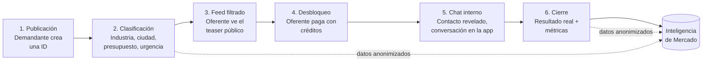

# Promot IA — Plan de Arquitectura

> "El cliente deja de buscar. Las empresas dejan de perseguir a ciegas."

Este documento define el modelo de producto, los actores, el flujo central y la arquitectura técnica y de seguridad recomendada para construir Promot IA desde cero. Es un documento vivo: se actualiza a medida que avanza el proyecto.

**Mercado inicial a explorar:** Ingeniería + Construcción (define la primera taxonomía de industrias/categorías a lanzar).

**Estructura corporativa (confirmado):** Promot IA es una marca de **Atlas Corporation S.A.S.**, empresa dueña de la idea — no es una sociedad separada. Esto se refleja en la política de tratamiento de datos (`docs/POLITICA-DATOS.md`) y deberá reflejarse también en los términos y condiciones y el pie legal de la futura landing/app.

## 1. El problema

Hoy, quien tiene una necesidad (una persona, una empresa, una entidad pública, una constructora, un comercio) no tiene un lugar único donde expresarla y ser encontrado por quien puede resolverla. El resultado:

- **La demanda busca a ciegas**: googlea, pide referencias, compara cotizaciones manualmente, no sabe si está pagando de más o si hay una mejor opción.
- **La oferta persigue a ciegas**: invierte en publicidad, fuerza comercial y prospección fría sin saber si esos leads realmente tienen una necesidad real, presupuesto o intención de compra.
- **Nadie tiene visibilidad del mercado**: no existe una fuente que diga "esto es lo que la gente/empresas están necesitando ahora mismo, en qué categoría, en qué zona, con qué frecuencia".

## 2. La propuesta de valor

Promot IA es una **plataforma de inteligencia de demanda**: el punto de encuentro donde la demanda se hace visible (de forma estructurada y clasificada) y la oferta responde de manera eficiente, sin publicidad masiva ni prospección a ciegas.

Tres capas de valor:

1. **Marketplace de intenciones de demanda** (el producto del MVP): el demandante publica lo que necesita; el oferente paga por acceder a esa oportunidad.
2. **Clasificación** (el motor invisible): estructurar necesidades no estructuradas en industria, ubicación, presupuesto y urgencia.
3. **Inteligencia de mercado** (producto de fase posterior): reportes agregados y anonimizados de tendencias de demanda — el segundo motor de ingresos, independiente del cobro por desbloqueo.

## 3. Dos ecosistemas: Demandante y Oferente

La plataforma tiene dos lados con flujos y economía completamente distintos. No es un marketplace simétrico — el demandante nunca paga por publicar; el oferente paga por acceder.

### Demandante (quien tiene una necesidad)

Personas, empresas, entidades públicas, constructoras, comercios.

**Flujo:** crear cuenta → publicar una Intención de Demanda (ID) → recibir el interés de las empresas que la desbloquean (potencialmente varias) → elegir con cuál(es) hablar por el chat interno → cerrar (o no) el negocio.

El demandante **no paga** por publicar ni por recibir interés — el ingreso viene del lado oferente.

### Oferente (quien busca oportunidades)

Empresas/profesionales registrados que pagan por acceder a intenciones de demanda de su industria.

**Flujo:** crear cuenta → suscribirse a un plan de créditos → explorar el feed de IDs disponibles en su industria/ciudad (solo ve la versión pública, sin datos de contacto) → decide desbloquear una ID específica (consume 1 crédito) → obtiene datos de contacto + adjuntos + chat interno habilitado con ese demandante → gestiona la relación comercial dentro de la plataforma.

## 4. Flujo central del producto



1. **Publicación**: el demandante llena el formulario de Intención de Demanda (ID) — ver estructura completa en la sección 5.
2. **Clasificación**: la ID queda etiquetada por industria/subcategoría (taxonomía controlada, no texto libre), ciudad, país, rango de presupuesto y nivel de urgencia.
3. **Feed filtrado**: cada oferente ve, según su industria y cobertura, un feed de IDs en su versión **pública** (teaser) — título, industria, ciudad, rango de presupuesto, urgencia, descripción y una miniatura de cada adjunto como gancho, pero **sin** datos de contacto ni los archivos originales.
4. **Desbloqueo**: el oferente hace clic en "Desbloquear contacto" en la ID que le interesa. Esto consume 1 crédito de su plan (ver sección 6) y es el paso crítico de todo el negocio — el detalle técnico está en la sección 6.
5. **Chat interno**: al desbloquear, se revelan los datos de contacto y los adjuntos completos (más allá de la miniatura ya visible en el teaser), y se habilita un hilo de mensajería entre esa ID y ese oferente. Toda la negociación ocurre dentro de la plataforma (ver sección 7).
6. **Cierre y feedback**: se registra si hubo negocio cerrado, con qué oferente y por qué valor estimado — esto alimenta tanto la calificación del oferente como la inteligencia de mercado agregada.

**Nota importante:** a diferencia de un modelo de "matching algorítmico" que empuja la necesidad a proveedores elegidos por el sistema, el MVP es un modelo de **marketplace auto-servicio**: el sistema filtra el feed por industria/ciudad, pero es el oferente quien decide qué oportunidades desbloquear. El matching automático/con IA (sugerir a qué oferentes notificar proactivamente) queda para una fase posterior (ver roadmap).

## 5. Estructura de una Intención de Demanda (ID)

Formulario que llena el demandante al publicar:

| Campo | Tipo | Notas |
|---|---|---|
| Título corto | Texto | Lo primero que ve el oferente en el feed |
| Industria | Selector (taxonomía controlada) | Arranca con subcategorías de Ingeniería + Construcción |
| País | Selector | |
| Ciudad | Selector/texto | Visible en el teaser; la dirección exacta no |
| Presupuesto estimado | Rango (mín–máx) | Visible en el teaser — ayuda al oferente a decidir si vale la pena desbloquear |
| Descripción detallada | Texto largo | Visible en el teaser |
| Urgencia | Baja / Media / Alta | Se muestra como etiqueta ("Alta prioridad") en el teaser |
| Adjuntos | Archivos (PDF, planos, fotos, video) | **Miniatura pública como gancho; archivo completo solo tras desbloqueo** |

**Contenido público (teaser, antes de pagar)** — lo que ve el oferente en el feed y en la tarjeta de la ID: título, industria, ciudad, rango de presupuesto, urgencia, descripción, **y una miniatura/preview de cada adjunto** (pensada como gancho para incentivar el desbloqueo — ej. una foto borrosa o recortada, o la primera página de un PDF/plano en baja resolución). No incluye datos de contacto ni el archivo original en resolución completa.

**Contenido desbloqueado (después de pagar):** nombre/razón social y datos de contacto del demandante, los archivos adjuntos completos (resolución/calidad original), y acceso al chat interno.

> **Nota técnica:** generar la miniatura (thumbnail) de forma automática al subir el adjunto — para PDFs/planos, renderizar la primera página como imagen; para fotos, una versión reducida/recortada; para video, un frame o miniatura estática. La miniatura se sirve públicamente, el archivo original queda protegido por RLS igual que el resto del contenido post-desbloqueo.

**Estados de una ID:** Publicada → Desbloqueada (por 1 o más oferentes) → En conversación → Cerrada / Perdida / Cancelada.

## 6. Mecanismo de desbloqueo, créditos y planes

Este es el mecanismo crítico del negocio — todo el modelo de ingresos del MVP depende de que esto sea correcto y a prueba de fraude/errores.

### Qué pasa cuando un oferente hace clic en "Desbloquear contacto"

1. El sistema verifica en el servidor (nunca confiando en el cliente) que el oferente tiene al menos 1 crédito disponible, o que su plan es ilimitado.
2. Se consume 1 crédito (excepto en el plan ilimitado, donde solo se registra el desbloqueo).
3. Se revelan los datos de contacto y los adjuntos de esa ID, solo para ese oferente.
4. Se habilita un hilo de chat interno entre el demandante y ese oferente.
5. Queda registrado que esa ID fue desbloqueada por esa empresa (una ID puede ser desbloqueada por varias empresas distintas — cada una consume su propio crédito).
6. Se notifica al demandante que una nueva empresa se interesó, para que pueda revisar y elegir con quién hablar.

**Por qué esto es crítico de construir bien (seguridad e integridad, no solo funcionalidad):** los pasos 2 a 5 deben ejecutarse como una sola transacción atómica en la base de datos. Si un oferente hace doble clic, o hay un corte de conexión a mitad del proceso, no debe poder pasar que se cobre el crédito sin revelar el contacto, ni que se revele el contacto sin cobrar el crédito. Esto se construye como una operación idempotente y validada 100% del lado del servidor.

### Planes de créditos (oferente)

| Plan | Créditos | Precio |
|---|---|---|
| Bronce | 1 crédito | USD $19 |
| Plata | 10 créditos | USD $99 |
| Oro | Ilimitado | USD $299 |

**Confirmado:** son planes de **suscripción mensual** — los créditos se renuevan cada ciclo de facturación (un oferente Plata vuelve a tener sus 10 créditos disponibles al iniciar el nuevo mes). Recomendación por defecto: los créditos no usados no se acumulan al mes siguiente (patrón estándar de planes SaaS) — a confirmar si prefieres permitir acumulación.

Los pagos y la gestión de suscripciones no deben construirse a mano: se recomienda un procesador como **Stripe Billing** (encaja bien con precios en USD), que maneja el cobro recurrente y que informa a la plataforma vía webhooks cuándo se pagó — la plataforma nunca debe asignar créditos porque el frontend "dice" que se pagó, sino porque el procesador de pago lo confirma del lado del servidor. Esto también evita que Promot IA tenga que tocar o almacenar datos de tarjetas (cumplimiento PCI lo asume el procesador).

## 7. Chat interno

Mensajería propia de la plataforma, no un enlace a WhatsApp/email externo — el objetivo explícito es que **toda la relación comercial ocurra dentro de Promot IA** para poder medirla:

- Mensajería con envío de documentos
- Llamada programada (agendar una fecha/hora dentro del hilo)
- Historial de conversación completo, por ID y por oferente

**Métricas que esto habilita** (el verdadero valor del chat interno, más allá de la comunicación):

- **Tiempo de respuesta**: del oferente al primer mensaje del demandante, y viceversa.
- **Tasa de conversión**: qué porcentaje de desbloqueos terminan en negocio cerrado.
- **Calidad del oferente**: score compuesto de tiempo de respuesta + tasa de conversión + calificación post-cierre — esto es lo que a futuro puede usarse para dar visibilidad preferente a los mejores oferentes en el feed.
- **Valor estimado del negocio**: cruce entre el presupuesto de la ID y si hubo cierre — esta es una de las métricas que alimenta directamente el producto de inteligencia de mercado.

## 8. Modelo de datos (alto nivel)

- **usuarios_demandante** — cuenta, rol, datos de contacto
- **usuarios_oferente** — cuenta, industria(s) que atiende, cobertura geográfica, plan activo
- **necesidades (ID)** — título, industria, país, ciudad, presupuesto_min/max, descripción, urgencia, estado
- **adjuntos** — archivo original (privado, post-desbloqueo), miniatura/preview (pública), tipo, necesidad asociada
- **industrias** — taxonomía controlada y jerárquica (arranca con Ingeniería + Construcción)
- **planes** — Bronce/Plata/Oro: nombre, créditos, precio
- **suscripciones** — oferente, plan, estado, créditos disponibles, ciclo de facturación
- **desbloqueos** — necesidad ↔ oferente, fecha, crédito consumido (una ID puede tener varios desbloqueos, de distintos oferentes)
- **mensajes** — hilo de chat por desbloqueo, remitente, contenido/adjunto, fecha, leído
- **llamadas_programadas** — desbloqueo asociado, fecha/hora, estado
- **calificaciones** — feedback post-cierre, alimenta el score del oferente
- **eventos_auditoria** — quién hizo qué y cuándo (seguridad e integridad de todo lo anterior)

## 9. Arquitectura técnica recomendada

Continuidad de stack con lo ya validado en otros proyectos (Tablero Piscinas usa Supabase con roles y RLS):

| Capa | Recomendación | Por qué |
|---|---|---|
| Frontend | Next.js / React + Tailwind, **responsive mobile-first** | Un solo código sirve para celular y computador — el oferente probablemente explora el feed desde el celular tanto como desde el escritorio |
| Backend / API | Funciones/API del framework + Supabase (Postgres) | El modelo relacional (IDs, desbloqueos, planes, mensajes) encaja bien en Postgres |
| Autenticación | Supabase Auth con roles: demandante / oferente / admin | Cada rol ve y puede hacer solo lo que le corresponde, aplicado también a nivel de base de datos |
| Pagos y suscripciones | Stripe Billing (Checkout + webhooks) | Maneja cobro recurrente, PCI compliance y confirma pagos del lado servidor — nunca se construye esto a mano |
| Clasificación (fase 2) | API de un modelo de lenguaje + reglas propias | La IA sugiere industria/urgencia, la taxonomía controla |
| Hosting | Vercel (frontend) + Supabase (datos) | Mismo patrón ya usado en otros proyectos |
| Notificaciones | Email transaccional + notificaciones in-app | Avisar al demandante de nuevo interés, al oferente de nuevos mensajes |

## 10. Seguridad e integridad — principios desde el día 1

1. **Row Level Security (RLS)**: un oferente no puede leer los datos de contacto ni el archivo original de un adjunto (solo la miniatura pública) de una ID que no ha desbloqueado, aplicado a nivel de base de datos — no solo ocultando el botón en el frontend.
2. **El desbloqueo es una transacción atómica y validada en servidor** (ver sección 6): nunca confiar en el cliente para decir "tengo créditos" o "ya pagué"; nunca permitir que un doble clic consuma dos créditos por un solo desbloqueo.
3. **Autenticación real y roles claros**: demandante, oferente y admin son roles distintos con permisos distintos, verificados en cada operación sensible.
4. **Cifrado en tránsito y en reposo**: HTTPS en todo; adjuntos y datos de contacto cifrados en la base de datos donde aplique.
5. **Protección de datos personales (Habeas Data, Ley 1581 de 2012)**: se necesita una política de tratamiento de datos propia de Promot IA (no reutilizar la de Atlas Corporation) — el mecanismo central del producto (revelar datos de contacto de un tercero a cambio de un pago que hace otra empresa) debe quedar explícitamente autorizado por el demandante desde el momento de publicar su ID. Ver borrador en `docs/POLITICA-DATOS.md`.
6. **Pagos**: nunca se procesan ni almacenan datos de tarjetas directamente — siempre a través de un procesador certificado (Stripe u equivalente).
7. **Nunca credenciales/llaves en el código**: variables de entorno / secret manager desde el primer commit.
8. **Validación de entradas en el servidor**: formularios (incluida la carga de archivos) y API se validan en el backend — previene inyección, XSS y archivos maliciosos disfrazados de PDF/plano.
9. **Rate limiting y anti-abuso**: límites en la publicación de IDs y en los intentos de desbloqueo para evitar IDs falsas o abuso del feed.
10. **Auditoría**: registro de quién publicó, desbloqueó, pagó o canceló qué y cuándo — necesario tanto para seguridad como para poder defender la integridad de las métricas (tiempo de respuesta, conversión) que se le venden al oferente como valor del plan.
11. **Backups y continuidad**: copias de seguridad automáticas desde el primer entorno de producción.
12. **Revisión de seguridad continua**: antes de cada lanzamiento importante, especialmente sobre el flujo de pagos/créditos y el control de acceso a adjuntos.

## 11. Modelo de negocio

**Motor principal (MVP): venta de créditos por plan.** El oferente paga por acceder a intenciones de demanda calificadas de su industria — reemplaza su gasto en publicidad y fuerza comercial. Bronce (1 crédito / $19), Plata (10 créditos / $99), Oro (ilimitado / $299).

**Motor secundario (fase posterior): inteligencia de mercado.** Reportes y dashboards de tendencias de demanda agregadas y anonimizadas, vendidos a gremios, constructoras grandes o entidades públicas — no depende del volumen de desbloqueos, es un producto de datos independiente.

**A validar más adelante:** comisión adicional sobre negocios cerrados (encima del cobro por desbloqueo) — no es necesaria para el MVP y puede introducir fricción si se combina mal con el modelo de créditos; se recomienda no mezclarla hasta tener datos reales de conversión.

## 12. Roadmap por fases

- **Fase 0 — Validación (ahora)**: landing page de presentación + captura de lista de espera (demandantes y oferentes interesados) para validar interés real.
- **Fase 1 — MVP marketplace completo**: registro demandante/oferente, formulario de ID con adjuntos, feed filtrado por industria/ciudad (arrancando en Ingeniería + Construcción), mecanismo de desbloqueo con créditos, planes Bronce/Plata/Oro vía Stripe, chat interno básico (mensajería + adjuntos + historial). Esto ya es un producto vendible, no un prototipo — el modelo de créditos no requiere intervención manual del equipo para funcionar.
- **Fase 2 — Automatización e inteligencia**: clasificación automática de industria/urgencia con IA, notificaciones proactivas a oferentes calificados, score de calidad de oferente, llamada programada integrada.
- **Fase 3 — Inteligencia de mercado**: panel de reportes agregados como producto adicional; explorar más verticales y fuentes públicas (ej. procesos SECOP) para entidades públicas/constructoras.

## 13. Estructura del proyecto sugerida

```
PromotIA/
├── docs/                      ← este documento, política de datos, y futura documentación
├── assets/                    ← logo, imágenes de marca
├── (fase 0) landing/          ← sitio estático de presentación
└── (fase 1+) app/             ← aplicación completa (marketplace, créditos, chat)
```

## 14. Próximos pasos inmediatos

1. **Revisar el borrador de política de datos actualizado** (`docs/POLITICA-DATOS.md`) — ya refleja a Atlas Corporation S.A.S. como responsable y el mecanismo de miniaturas públicas; sigue pendiente de revisión legal antes de publicarse.
2. **Definir la taxonomía inicial de Ingeniería + Construcción** (subcategorías concretas) — condiciona el formulario de ID y el filtro del feed.
3. **Construir la landing de Fase 0** con el logo, la propuesta de valor y un formulario de lista de espera para ambos lados (demandante/oferente).
