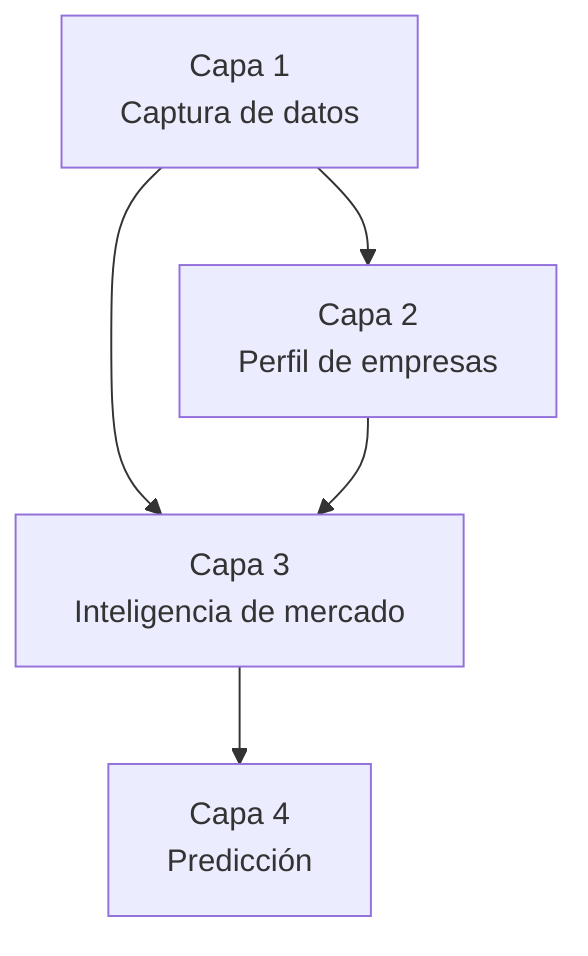

# Motor de Inteligencia de Demanda (MID) — Estructura de Base de Datos

> El MID no es solo el almacenamiento de la plataforma: es el sistema que aprende continuamente del comportamiento del mercado a partir de lo que ya se captura en cada publicación, cada perfil y cada interacción. Este documento define su estructura de datos en 4 capas, y complementa el modelo de datos de alto nivel de `docs/ARQUITECTURA.md` (sección 12) con el detalle completo de columnas.

## Las 4 capas, de un vistazo

Cada capa se alimenta de la anterior — no son 4 sistemas separados, son 4 niveles de profundidad sobre los mismos datos. Las capas 1 y 2 capturan; las capas 3 y 4 son **siempre datos derivados y agregados**, nunca tablas nuevas de información cruda.

---

## Capa 1 — Captura de datos

Lo que se guarda cada vez que un demandante publica una Intención de Demanda (ID). Expande la tabla `necesidades` ya prevista en `docs/ARQUITECTURA.md`.

### Tabla `necesidades`

| Campo | Tipo | Notas |
|---|---|---|
| `id` | uuid | |
| `demandante_id` | uuid (FK) | |
| `titulo` | texto | |
| `descripcion` | texto | Incluye las 3 preguntas guiadas (qué necesita / qué problema / qué resultado) |
| `industria_id` | FK → `industrias` | |
| `subindustria_id` | FK → `industrias` (jerárquico) | **Nuevo (Capa 1)** — un nivel más de detalle bajo industria |
| `ciudad` | texto | |
| `pais` | texto | |
| `presupuesto_min` / `presupuesto_max` | numérico | |
| `fecha_requerida` | fecha | **Nuevo (Capa 1)** — fecha concreta, distinta de "urgencia" |
| `urgencia` | enum (baja/media/alta) | |
| `tipo_servicio` | texto/enum | **Nuevo (Capa 1)** |
| `palabras_clave` | `tsvector` + arreglo de texto | **Nuevo (Capa 1)** — `tsvector` habilita búsqueda de texto completo; el arreglo simple sirve para agregaciones en la Capa 3 |
| `tipo_cliente` | enum (persona / empresa / entidad) | **Nuevo (Capa 1)** — formaliza lo que hoy el registro solo captura como "persona o empresa" |
| `estado` | enum (publicada/desbloqueada/en conversación/cerrada/perdida/cancelada) | Workflow operativo |
| `nivel_confianza` | enum (publicada/verificada/activa/adjudicado) | Demanda Verificada (`docs/ARQUITECTURA.md` §9) — distinto de `estado`, se recalcula cuando se confirma contacto/NIT/contenido o cuando cambian los desbloqueos |
| `creado_en` | timestamp | |

### Tabla `necesidad_adjuntos`

| Campo | Tipo | Notas |
|---|---|---|
| `id` | uuid | |
| `necesidad_id` | FK | |
| `archivo_url` | texto | Privado — protegido por RLS hasta el desbloqueo |
| `miniatura_url` | texto | Pública |
| `tipo_archivo` | enum (pdf/plano/foto/video) | |

### Tabla `industrias` (jerárquica)

| Campo | Tipo | Notas |
|---|---|---|
| `id` | uuid | |
| `nombre` | texto | |
| `padre_id` | FK → `industrias` (nullable) | Permite industria → subindustria en la misma tabla |

---

## Capa 2 — Perfil de las empresas

Un perfil mucho más completo por cada oferente — expande `usuarios_oferente`. Varios de estos campos ya habían aparecido en el registro y en el perfil de reputación de la landing; aquí quedan consolidados formalmente.

### Tabla `perfiles_oferente`

| Campo | Tipo | Notas |
|---|---|---|
| `oferente_id` | uuid (FK, 1:1 con la cuenta) | |
| `especialidades` | arreglo de `industria_id` | |
| `ciudades_operacion` | arreglo de texto | |
| `tamano_empresa` | enum (1–10 / 11–50 / 51–200 / 200+) | |
| `certificaciones` | arreglo de texto | |
| `sectores_atendidos` | arreglo de texto | Distinto de "especialidades": a qué tipo de cliente ha servido (ej. industria alimentaria, sector público) |
| `tecnologias_dominadas` | arreglo de texto | |
| `rango_proyecto_min` / `rango_proyecto_max` | numérico | Tamaño típico de proyecto que ejecuta |
| `tiempo_respuesta_promedio_horas` | numérico, calculado | Derivado de `mensajes` (ya definida) |
| `nivel_satisfaccion` | numérico (0–5), calculado | Derivado de `calificaciones` (ya definida) |
| `fecha_registro` | timestamp | Antigüedad — ya usada en el perfil de reputación |

**Esto es exactamente el insumo del IAC** (sección 6 de `docs/ARQUITECTURA.md`): especialidades, experiencia (vía proyectos/antigüedad), ubicación, capacidad operativa (tamaño vs. rango de proyecto), historial y tiempo de respuesta ya están todos aquí. El IAC no necesita una tabla propia de "inputs" — lee directamente de `perfiles_oferente` + `necesidades` + `calificaciones`.

---

## Capa 3 — Inteligencia de mercado

**Aquí empieza el verdadero valor**, y también el punto más delicado de privacidad. Regla no negociable: **esta capa nunca expone una fila individual** — solo responde con datos agregados, y solo si el grupo agregado tiene un mínimo de muestras (ej. mínimo 5 necesidades distintas) para que no se pueda inferir quién publicó una necesidad puntual a partir de un cruce demasiado específico (ciudad + industria + rango de presupuesto muy angosto, por ejemplo).

Se implementa como **vistas** (consultas que resumen datos en tiempo real o casi-real), no como tablas con datos crudos duplicados:

| Vista | Responde | Agregación |
|---|---|---|
| `vista_demanda_industria_ciudad` | ¿Qué servicios se solicitan más en Medellín? | Conteo de necesidades por industria + ciudad + periodo |
| `vista_presupuestos_predominantes` | ¿Qué presupuestos predominan? | Distribución de rangos de presupuesto por industria/ciudad |
| `vista_cobertura_oferta` | ¿En qué ciudades hacen falta más proveedores? | Necesidades publicadas vs. oferentes activos, por ciudad + industria |
| `vista_necesidades_sin_respuesta` | ¿Qué necesidades permanecen sin respuesta? | Necesidades publicadas hace más de X días sin ningún desbloqueo |
| `vista_tiempo_primer_contacto` | ¿Cuánto tarda una necesidad en recibir su primer desbloqueo/mensaje? | Promedio de (fecha del primer desbloqueo − `creado_en`) por industria/ciudad/periodo |
| `vista_tasa_atencion` | ¿Qué porcentaje de necesidades reciben al menos un desbloqueo? | Necesidades con ≥1 desbloqueo ÷ total publicado, por periodo |
| `vista_valor_mercado_generado` | ¿Cuál es el valor estimado del mercado que pasa por la plataforma? | Suma del punto medio de presupuesto de las necesidades del periodo |

Cada vista aplica el umbral mínimo de agregación **antes** de devolver el dato — si un cruce tiene menos muestras que el umbral, la vista no lo muestra (en vez de mostrar un número que podría identificar a alguien). Las últimas tres vistas son el insumo directo del **Observatorio de la Demanda** (`docs/ARQUITECTURA.md`, sección 8).

---

## Capa 4 — Predicción

Con suficiente historial acumulado en la Capa 3, el sistema puede comparar un periodo contra el anterior y generar los insights que diste como ejemplo ("la demanda de sistemas fotovoltaicos subió 35%").

### Tabla `tendencias_mercado`

| Campo | Tipo | Notas |
|---|---|---|
| `id` | uuid | |
| `industria_id` / `subindustria_id` | FK | |
| `ciudad` | texto (nullable — algunas tendencias son nacionales) | |
| `periodo` | fecha (mes o trimestre) | |
| `metrica` | enum (conteo_necesidades / presupuesto_promedio / oferentes_activos) | |
| `valor` | numérico | |
| `valor_periodo_anterior` | numérico | |
| `variacion_pct` | numérico, calculado | |
| `tipo_insight` | enum (creciente / decreciente / escasez_oferta) | |
| `texto_generado` | texto | El insight en lenguaje natural — ej. "En Cali hay escasez de empresas especializadas en estructuras metálicas" |
| `generado_en` | timestamp | |

Se calcula con un **job periódico** (ej. mensual) que compara las vistas de la Capa 3 entre periodos consecutivos y genera un registro cuando la variación supera un umbral configurable — no se genera un insight por cada variación mínima, solo cuando es lo suficientemente significativa para ser útil.

Con historial suficiente, esta tabla es el producto directo del "motor secundario de negocio: inteligencia de mercado" ya descrito en `docs/ARQUITECTURA.md` (sección 15) — vendible como reportes a gremios, constructoras grandes o entidades públicas, a través del Observatorio de la Demanda (sección 8).

**Conexión con el Índice de Oportunidad (IO):** el factor más difícil del IO (`docs/ARQUITECTURA.md`, sección 7) es "probabilidad de contratación" — arranca como heurística, pero es exactamente el tipo de predicción que esta capa habilita una vez haya suficientes casos históricos de necesidades "cerradas" vs. "perdidas" para comparar. El mismo dato que alimenta `tendencias_mercado` (agregado) también puede entrenar ese factor (a nivel de ID individual) — son dos consumos distintos del mismo historial.

---

## Cómo se conecta con lo ya definido

- **Capa 1** alimenta el feed/matching (sección 4 de ARQUITECTURA.md) y es la fuente cruda de la que parten las capas 3 y 4.
- **Capa 2** es el insumo directo del IAC (sección 6).
- **Capas 3 y 4** son la base técnica del Observatorio de la Demanda (sección 8), del motor de negocio de inteligencia de mercado (sección 15) y del roadmap de Fase 3 (sección 16).

## Seguridad y privacidad de esta capa (además de lo ya definido en ARQUITECTURA.md §14)

1. **Las capas 3 y 4 solo trabajan con agregados** — ninguna vista ni tabla de esta capa incluye un identificador de demandante u oferente individual.
2. **Umbral mínimo de agregación** (una forma simple de k-anonimato): un cruce con menos muestras que el umbral no se muestra, se oculta o se agrupa con una categoría más amplia.
3. **Rol de acceso propio para analítica**: incluso dentro del equipo, quien consulta las vistas de inteligencia de mercado no necesita (ni debería tener) el mismo rol que accede a los datos operativos crudos (contactos, adjuntos) — separar estos roles limita el daño si una credencial se compromete.

## Próximos pasos para esta capa

1. Definir el umbral mínimo exacto de agregación (5 es un punto de partida razonable, pero depende del volumen real una vez la plataforma tenga tráfico).
2. Definir la frecuencia del job de la Capa 4 (mensual es el punto de partida propuesto) y el umbral de variación que dispara un insight.
3. Decidir si `palabras_clave`/`tipo_servicio` usan una lista controlada (como la taxonomía de industrias) o texto libre con normalización posterior — texto libre da más riqueza para el MID pero exige más limpieza antes de que sirva para agregación.
